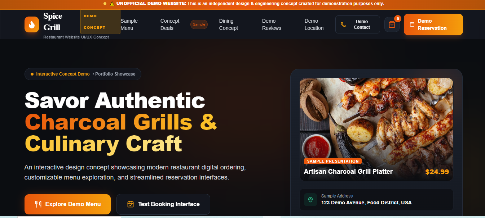
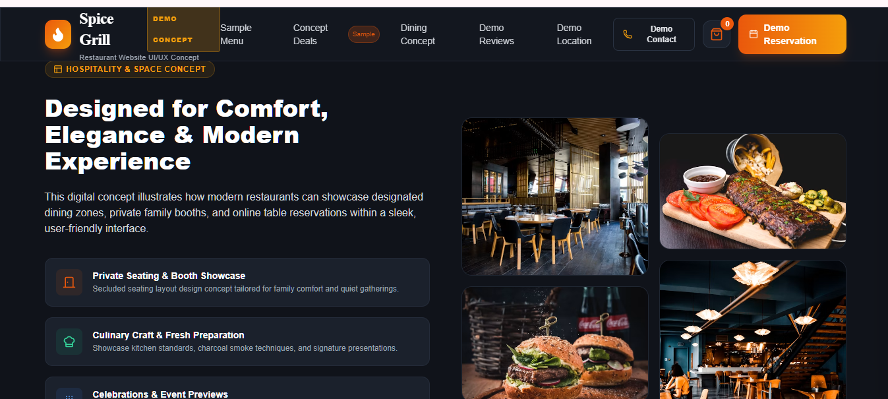
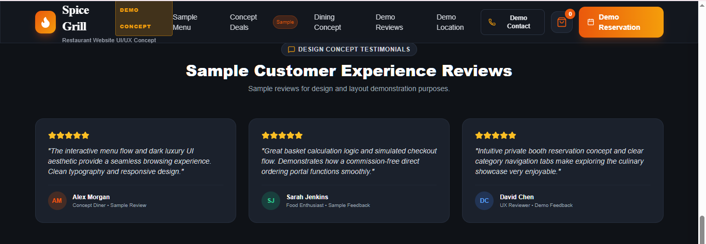
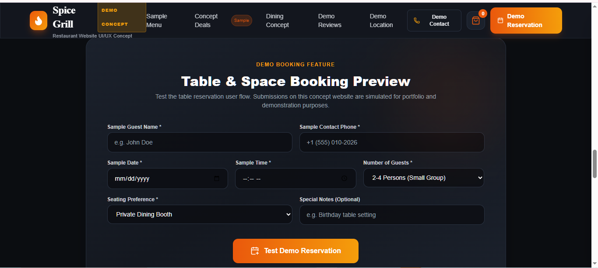

# Spice Grill — Restaurant Website Concept

> **Unofficial Demo / Concept Project**  
> This website is a restaurant website concept created for demonstration and portfolio purposes. It is **not affiliated with, endorsed by, or operated by Spice Grill**.

## 🍽️ About the Project

Spice Grill is a modern restaurant website concept designed to demonstrate a premium digital dining experience.

The project includes a customer-facing restaurant storefront, interactive menu browsing, a simulated cart, reservation interface, and an administrative dashboard connected through a REST API.

The website uses sample/demo content and is intended for **portfolio presentation and UI/UX demonstration**.

---

## ✨ Features

### Customer Website

- Modern responsive restaurant homepage
- Interactive menu browsing
- Category-based menu filtering
- Add items to cart
- Increase/decrease item quantities
- Automatic subtotal calculation
- Delivery calculation
- Simulated ordering flow
- Demo reservation interface
- Mobile navigation drawer
- Custom modals and interactive UI components
- Responsive design for desktop, tablet, and mobile
- Modern dark-luxury visual design
- Glassmorphism and gradient effects

### Admin Dashboard

- Admin authentication
- Protected admin routes
- Menu management
- Category management
- Order management
- Reservation management
- Dashboard statistics
- Analytics endpoints
- Protected administrative API functionality

---

## 📸 Screenshots

### Homepage



### Dining Concepts



### Demo Reviews



### Demo Reservation



---

## 🛠️ Technology Stack

### Frontend

- HTML5
- Tailwind CSS v3
- Vanilla JavaScript (ES6+)
- Fetch API
- REST API integration
- Lucide Icons
- Google Fonts
  - Plus Jakarta Sans
  - Playfair Display
  - Inter

### Backend

- Node.js
- Express.js v5
- REST API
- CORS
- dotenv
- JWT authentication
- bcryptjs
- MVC-style project structure

### Database

- SQLite
- better-sqlite3
- Foreign-key constraints
- Database transactions
- WAL (Write-Ahead Logging)
- Automatic schema initialization
- Demo-data seeding

---

## 🏗️ Architecture

```text
Customer Storefront
        │
        │ HTTP / JSON
        ▼
     REST API
        │
        ▼
Node.js + Express.js
        │
        ├── Routes
        ├── Controllers
        ├── Middleware
        ├── Authentication
        └── Business Logic
        │
        ▼
   better-sqlite3
        │
        ▼
   SQLite Database
```

The project also includes a separate admin portal for managing demo restaurant data.

---

## 🔌 API

The backend provides REST API endpoints for the application's main functionality.

Example API areas include:

```text
/api/menu
/api/orders
/api/reservations
/api/admin
/api/stats
```

The frontend communicates with the backend using asynchronous HTTP requests and JSON data.

---

## 🔐 Authentication & Security

The backend includes:

- JWT-based authentication
- Password hashing with bcryptjs
- Protected admin API endpoints
- Authentication middleware
- Environment-based configuration
- CORS configuration
- SQLite foreign-key constraints
- Transaction-based database operations

Sensitive environment files and local database files are excluded from the public repository.

---

## 🤖 AI-Assisted Development

This project was developed using an **AI-assisted development workflow**.

AI tools were used to assist with generating and modifying project code and files based on my requirements, prompts, implementation direction, and requested improvements.

My contribution included:

- Defining the project concept and overall direction
- Planning features and functionality
- Providing prompts and implementation requirements
- Reviewing generated code and project output
- Requesting changes and improvements
- Testing the website and functionality
- Making project and feature decisions
- Reviewing the overall user experience
- Setting up the Git repository
- Managing Git commits
- Setting up and managing the GitHub repository
- Preparing the project for deployment

This project demonstrates an **AI-assisted approach to full-stack web development**, combined with human planning, review, testing, and decision-making.

---

## 📁 Project Structure

```text
Spice Grill Website/
│
├── admin/
│   └── index.html
│
├── backend/
│   ├── config/
│   ├── controllers/
│   ├── middleware/
│   ├── routes/
│   └── server.js
│
├── home-page.png
├── Dining-Concepts.png
├── Demo-Reviews.png
├── Demo-Reservation.png
├── index.html
├── package.json
├── package-lock.json
├── .gitignore
└── README.md
```

---

## 🎨 Design

The website focuses on creating a premium restaurant experience through:

- Dark-luxury visual styling
- Modern typography
- Responsive layouts
- Glassmorphism effects
- Gradient and glow effects
- Interactive menu experience
- Clear call-to-action sections
- Mobile-friendly navigation
- Customer ordering interface
- Administrative management interface

---

## 🧪 Demo Safety

This project is presented as an **unofficial concept/demo website**.

It uses:

- Sample menu content
- Sample pricing
- Demo address information
- Conceptual restaurant information
- Simulated ordering functionality
- Demo reservation functionality

The website is not intended to process real customer orders, payments, or reservations.

> **Unofficial Demo — Not affiliated with or endorsed by the restaurant.**

---

## 🎯 Project Purpose

This project was created to explore and demonstrate practical concepts in:

- Frontend web development
- Full-stack application structure
- REST API architecture
- Backend development
- Database integration
- Authentication
- Admin dashboard development
- Responsive UI design
- Git and GitHub workflow
- AI-assisted development
- Deployment preparation

---

## 🚀 Future Improvements

Possible future improvements include:

- Production database integration
- Online payment integration
- Real-time order tracking
- Email notifications
- WhatsApp order notifications
- Advanced admin analytics
- Customer accounts
- Order history
- Image management
- Production-grade deployment architecture

---

## 👤 Project By

**Pakeeza**
